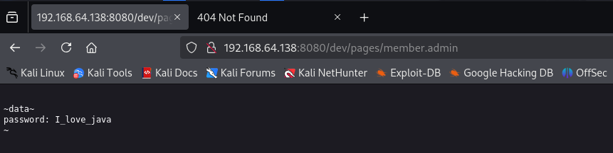
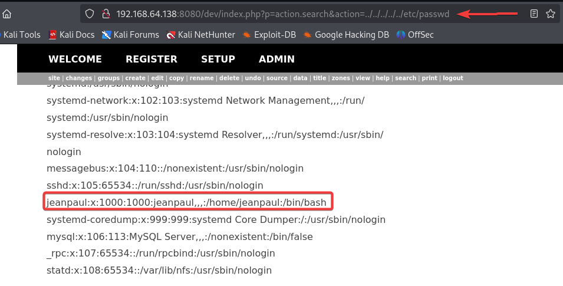

# Dev - walkthrough
Să începem cu scanarea porturilor deschise pentru o reprezentare mai clara pentru mașina data:
```
nmap -sS -A -T4 --min-rate 1500 -p- 192.168.64.138
```
```
22/tcp    open  ssh      OpenSSH 7.9p1 Debian 10+deb10u2 (protocol 2.0)
| ssh-hostkey: 
|   2048 bd:96:ec:08:2f:b1:ea:06:ca:fc:46:8a:7e:8a:e3:55 (RSA)
|   256 56:32:3b:9f:48:2d:e0:7e:1b:df:20:f8:03:60:56:5e (ECDSA)
|_  256 95:dd:20:ee:6f:01:b6:e1:43:2e:3c:f4:38:03:5b:36 (ED25519)
80/tcp    open  http     Apache httpd 2.4.38 ((Debian))
|_http-server-header: Apache/2.4.38 (Debian)
|_http-title: Bolt - Installation error
111/tcp   open  rpcbind  2-4 (RPC #100000)
| rpcinfo: 
|   program version    port/proto  service
|   100000  2,3,4        111/tcp   rpcbind
|   100000  2,3,4        111/udp   rpcbind
|   100000  3,4          111/tcp6  rpcbind
|   100000  3,4          111/udp6  rpcbind
|   100003  3           2049/udp   nfs
|   100003  3           2049/udp6  nfs
|   100003  3,4         2049/tcp   nfs
|   100003  3,4         2049/tcp6  nfs
|   100005  1,2,3      42805/tcp   mountd
|   100005  1,2,3      48144/udp6  mountd
|   100005  1,2,3      53181/udp   mountd
|   100005  1,2,3      56255/tcp6  mountd
|   100021  1,3,4      34389/tcp   nlockmgr
|   100021  1,3,4      35047/tcp6  nlockmgr
|   100021  1,3,4      36698/udp   nlockmgr
|   100021  1,3,4      45998/udp6  nlockmgr
|   100227  3           2049/tcp   nfs_acl
|   100227  3           2049/tcp6  nfs_acl
|   100227  3           2049/udp   nfs_acl
|_  100227  3           2049/udp6  nfs_acl
2049/tcp  open  nfs      3-4 (RPC #100003)
8080/tcp  open  http     Apache httpd 2.4.38 ((Debian))
| http-open-proxy: Potentially OPEN proxy.
|_Methods supported:CONNECTION
|_http-title: PHP 7.3.27-1~deb10u1 - phpinfo()
|_http-server-header: Apache/2.4.38 (Debian)
34389/tcp open  nlockmgr 1-4 (RPC #100021)
35407/tcp open  mountd   1-3 (RPC #100005)
42805/tcp open  mountd   1-3 (RPC #100005)
45233/tcp open  mountd   1-3 (RPC #100005)
```
### Serviciul nfs
Observăm ca avem acest serviciul activm să verificam ce directoarea sunt disponibile pentru montare:
```
showmount -e 192.168.64.138
```
```
Export list for 192.168.64.138:
/srv/nfs 172.16.0.0/12,10.0.0.0/8,192.168.0.0/16
```
Montăm acest directoriul la noi:
```
mount -t nfs 192.168.64.138:/srv/nfs /tmp/nfs_share_dir
```
Avem un fișier care are denumirea de `save.zip` în cazul în care încercăm săl dezarhivăm ne cere parola:
Putem so spargem cu utilita `zip2john` care ne trasformat fișierul în hash și pe urma cu atacul de metotă bruta încearcă săl spargă:
```
zip2john save.zip > save.zip.hash
```
Atacul de tip brute force:
```
john save.zip.hash
```
```
Using default input encoding: UTF-8
Loaded 1 password hash (PKZIP [32/64])
Will run 4 OpenMP threads
Proceeding with single, rules:Single
Press 'q' or Ctrl-C to abort, almost any other key for status
Almost done: Processing the remaining buffered candidate passwords, if any.
Proceeding with wordlist:/usr/share/john/password.lst
Proceeding with incremental:ASCII
java101          (save.zip)
```
În urmare avem 2 fișiere noi `id_rsa` și `todo.txt` conținutul la `todo.txt` este mai jos:
```
- Figure out how to install the main website properly, the config file seems correct...
- Update development website
- Keep coding in Java because it's awesome
jp
```


# HZ CE MAI DEPARTE



