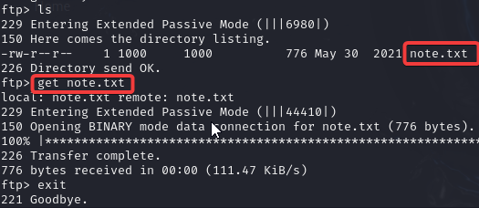

# Academy - walkthrough
Informație pentru logarea:
```credințiale
Login: root
Password: tcm
IP: 192.168.64.137
```
Începem cu scanarea servicilor active pe hostul victimă folosim instrumentul [[nmap]]:
Comanda pentru scanare este:
```bash
nmap -sS -A -T4 --min-rate 1500 -p- $Academy
```
Unde *$Academy* este IP adresa a hostului

Dupa scanarea porturilor observăm ca avem urmatoarele porturi deschise:
- 21 [[ftp]] (este posibilă logarea cu utilizatorul *Anonymous* )
- 22 [[ssh]] (pentru conectări la distanță)
- 80 [[http]] (este vectorul cel mai înteresant)
### FTP vector
Verificăm dacă este posibil logareaca *anonymous* 

Passwordul este `NULL` deci nu este introdus doar facem `Enter`

Verificăm ce fișiere avem pe *ftp* observăm că avem doar un fișier cu denumirea *note.txt*:
Conținutul fișierului *note.txt*:
```
Hello Heath !
Grimmie has setup the test website for the new academy.
I told him not to use the same password everywhere, he will change it ASAP.


I couldn't create a user via the admin panel, so instead I inserted directly into the database with the following command:

INSERT INTO `students` (`StudentRegno`, `studentPhoto`, `password`, `studentName`, `pincode`, `session`, `department`, `semester`, `cgpa`, `creationdate`, `updationDate`) VALUES
('10201321', '', 'cd73502828457d15655bbd7a63fb0bc8', 'Rum Ham', '777777', '', '', '', '7.60', '2021-05-29 14:36:56', '');

The StudentRegno number is what you use for login.


Le me know what you think of this open-source project, it's from 2020 so it should be secure... right ?
We can always adapt it to our needs.

-jdelta
```
Din informația dată avem utilizatorul înregistrat in baza de date cu parola criptată cu algoritmul MD5:
```
cd73502828457d15655bbd7a63fb0bc8 -> student
```
Datele pentru logare sunt (trebuie să depestăm care este end-pointul pentru logare):
```
Login: 10201321
Password: student
```
### SSH
La serviciul *SSH* nu sunt puncte slabe dar pe vitor este posibil conectarea la distanță.
```
22/tcp open  ssh     OpenSSH 7.9p1 Debian 10+deb10u2 (protocol 2.0)
| ssh-hostkey: 
|   2048 c7:44:58:86:90:fd:e4:de:5b:0d:bf:07:8d:05:5d:d7 (RSA)
|   256 78:ec:47:0f:0f:53:aa:a6:05:48:84:80:94:76:a6:23 (ECDSA)
|_  256 99:9c:39:11:dd:35:53:a0:29:11:20:c7:f8:bf:71:a4 (ED25519)
```
### HTTP
Să încercăm să scanăm cu utilita *nikto* și să verificăm ce vulnerabilități sunt depistate.
```bash
nikto -host http://192.168.64.137/
```

Observăm doar un director *phpmyadmin* care este o interfața pentru conectarea cu bazele de date.

Să verificăm ce directoare ascunse avem pe pagina web cu utilita *gobuster*:
```
gobuster dir -w /usr/share/seclists/Discovery/Web-Content/directory-list-2.3-big.txt -u http://192.168.64.137/
```


```
/academy              (Status: 301) [Size: 318] [--> http://192.168.64.137/academy/]
/phpmyadmin           (Status: 301) [Size: 321] [--> http://192.168.64.137/phpmyadmin/]
/server-status        (Status: 403) [Size: 279]
```

Avem 2 directoare ascunse verifiсă și directoarele date:
##### academy
```
gobuster dir -w /usr/share/seclists/Discovery/Web-Content/directory-list-2.3-big.txt -u http://192.168.64.137/academy
```
Rezultatul este:
```
/admin                (Status: 301) [Size: 324] [--> http://192.168.64.137/academy/admin/]
/assets               (Status: 301) [Size: 325] [--> http://192.168.64.137/academy/assets/]
/includes             (Status: 301) [Size: 327] [--> http://192.168.64.137/academy/includes/]
/db                   (Status: 301) [Size: 321] [--> http://192.168.64.137/academy/db/]
```
##### phpmyadmin
```
gobuster dir -w /usr/share/seclists/Discovery/Web-Content/directory-list-2.3-big.txt -u http://192.168.64.137/phpmyadmin
```
Rezultatul este:
```
/templates            (Status: 403) [Size: 279] [--> http://192.168.64.137/phpmyadmin/templates/]
/themes               (Status: 301) [Size: 301] [--> http://192.168.64.137/phpmyadmin/themes/]
/doc                  (Status: 301) [Size: 325] [--> http://192.168.64.137/phpmyadmin/doc/]
/examples             (Status: 301) [Size: 330] [--> http://192.168.64.137/phpmyadmin/examples/]
/README               (Status: 200) [Size: 1520] [--> http://192.168.64.137/phpmyadmin/README/]
/js                   (Status: 301) [Size: 324] [--> http://192.168.64.137/phpmyadmin/js/]
/libraries            (Status: 403) [Size: 279] [--> http://192.168.64.137/phpmyadmin/libraries/]
/vendor               (Status: 301) [Size: 17598] [--> http://192.168.64.137/phpmyadmin/vendor/]
/ChangeLog            (Status: 200) [Size: 461] [--> http://192.168.64.137/phpmyadmin/ChangeLog/]
/setup                (Status: 401) [Size: 461] [--> http://192.168.64.137/phpmyadmin/setup/]
/sql                  (Status: 301) [Size: 325] [--> http://192.168.64.137/phpmyadmin/sql/]
/LICENSE              (Status: 200) [Size: 18092] [--> http://192.168.64.137/phpmyadmin/LICENSE/]
/locale               (Status: 301) [Size: 328] [--> http://192.168.64.137/phpmyadmin/locale/]
```

E ușor să ne pierdim în toate aceste directoare dar sa mergem pe rând și verificam urmatorul `/academy/db` 
## ZAIBALSEA TODO